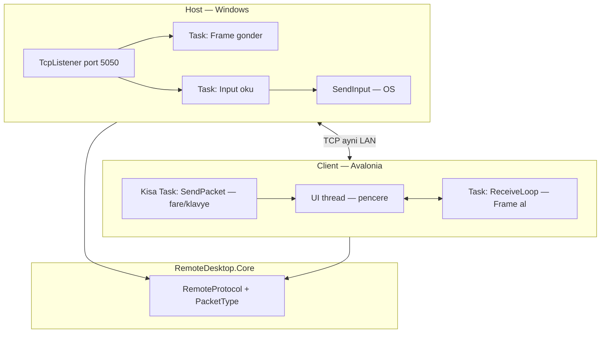
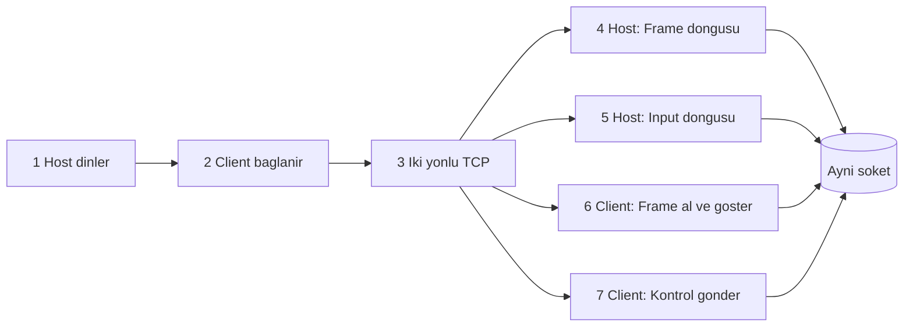
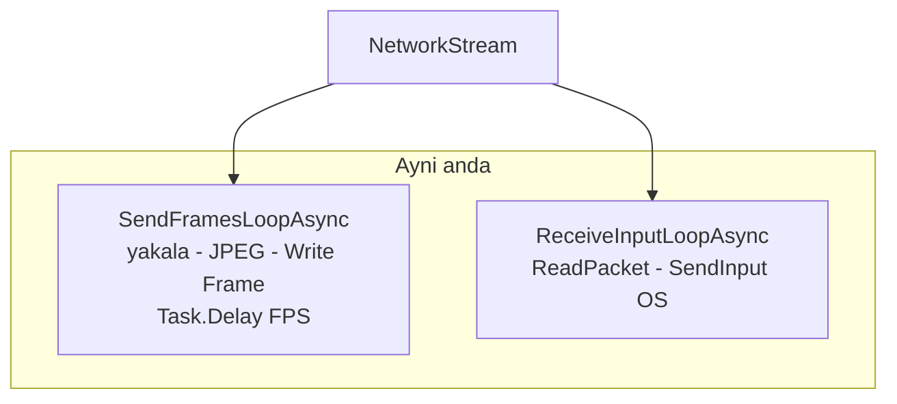
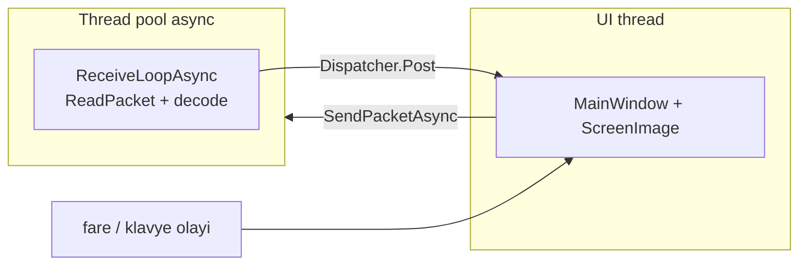
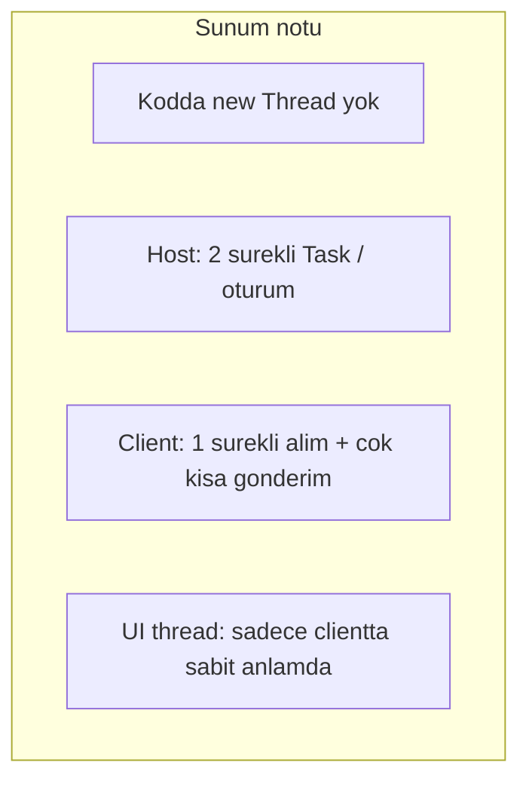
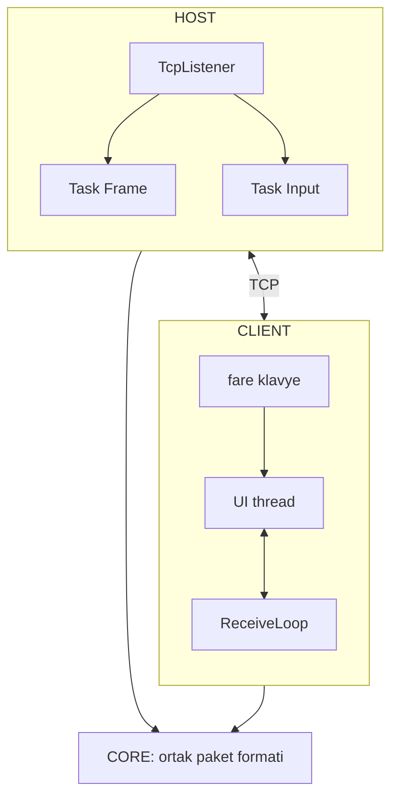

# Mermaid Live — gorsel sunum

1. Ac: [https://mermaid.live](https://mermaid.live)  
2. Asagidaki kodu **Code** paneline yapistir.  
3. **Actions → PNG / SVG** ile slayta ekle.

---

## Diyagram 1 — Genel mimari (moduller + TCP)

---

## Diyagram 2 — Baglanti sonrasi akis (adim adim)

---

## Diyagram 3 — Host icinde paralel 2 Task

---

## Diyagram 4 — Client: UI thread + alim

---

## Diyagram 5 — Thread / Task ozet kutular

---

## Tek diyagramda hepsi (sade slayt — bir sayfa)

Daha kalabalik; slayt buyukse kullan.

