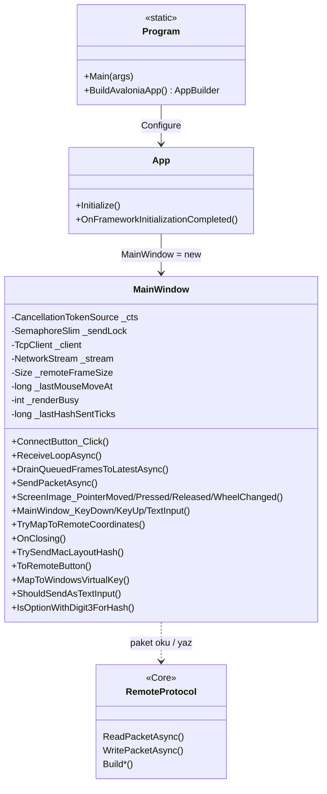
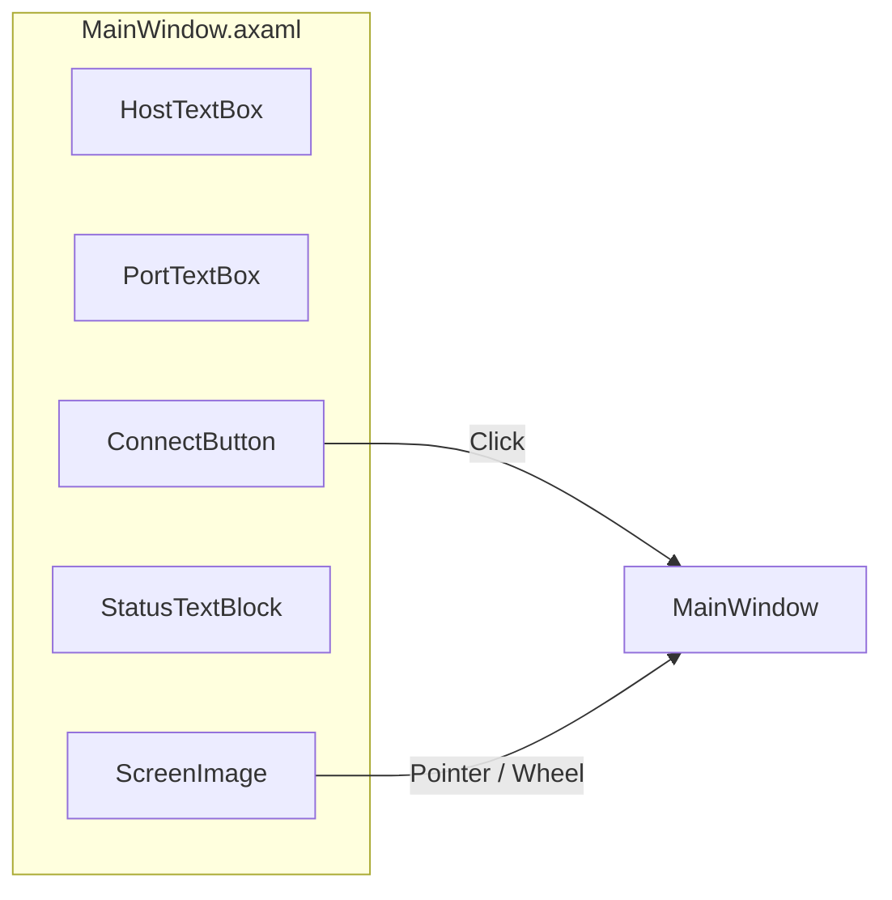

# Sunum notlari — RemoteDesktop.Client.Cross

Avalonia masaustu istemcisi: `Program` → `App` → `MainWindow`. Asil ag + UI mantigi `MainWindow.axaml.cs` icindedir.

Slayt icin Mermaid: [mermaid.live](https://mermaid.live)

---

## UML (Mermaid) — siniflar

---

## UML (Mermaid) — istege bagli: UI XAML

---

## Metotlar ve alanlar — ne ise yarar? (slayt listesi)

### Uygulama baslatma

1. **`Program.Main`** — `BuildAvaloniaApp().StartWithClassicDesktopLifetime(args)` ile Avalonia masaustu yasam dongusunu baslatir. `[STAThread]` COM/UI uyumu.

2. **`Program.BuildAvaloniaApp`** — `App` sinifini baglar; platform, Inter font, trace loglama.

3. **`App.Initialize`** — XAML yuklemesi (`AvaloniaXamlLoader.Load`).

4. **`App.OnFrameworkInitializationCompleted`** — Masaustu omru icinde `MainWindow` olusturulup ana pencere atanir.

### Ag ve yasam dongusu (`MainWindow`)

5. **`_cts`** — Baglanti ve donguleri iptal etmek icin `CancellationTokenSource`.

6. **`_sendLock` (`SemaphoreSlim(1,1)`)** — `SendPacketAsync` icinde **async** ortamda tek yazici: ayni anda birden fazla `WritePacketAsync` cakismasin.

7. **`_client` / `_stream`** — TCP baglantisi ve `NetworkStream`.

8. **`_remoteFrameSize`** — Son gelen karenin piksel boyutu (koordinat eslemesi icin).

9. **`_renderBusy`** — `Interlocked` ile: ayni anda birden fazla kare decode/UI atama yarisi onleme.

10. **`_lastMouseMoveAt`** — `Interlocked` ile fare `MouseMove` gonderimini ~12 ms ile sinirlama.

11. **`_lastHashSentTicks`** — Mac’te `#` icin cift `TextInput` onleme.

### Baglanma ve video alma

12. **`ConnectButton_Click`** — Port/host dogrulama; `ReceiveLoopAsync`’i `await` eder; hata ve buton durumu.

13. **`ReceiveLoopAsync`** — `TcpClient.ConnectAsync`, `NoDelay`, sonsuz dongude `ReadPacketAsync`; sadece `Frame` isler; `DrainQueuedFramesToLatestAsync` ile TCP kuyrugundaki eski kareleri atip **en son** payload’i tutar; `Interlocked` render kilidi; JPEG’den `Bitmap`; `Dispatcher.UIThread.Post` ile `ScreenImage.Source` atamasi.

14. **`DrainQueuedFramesToLatestAsync`** — `Socket.Poll` + `Available` ile bekleyen ek paketleri okur; her `Frame` ile `latestPayload` guncellenir (dusuk bantta gecikme azaltma).

### Gonderim

15. **`SendPacketAsync`** — Baglanti ve `_cts` kontrolu; `_sendLock` altinda `RemoteProtocol.WritePacketAsync`.

### Fare

16. **`ScreenImage_PointerMoved`** — Throttle + `TryMapToRemoteCoordinates`; `MouseMove` + `BuildMouseMovePayload`.

17. **`ScreenImage_PointerPressed` / `PointerReleased`** — `ToRemoteButton`; `MouseDown` / `MouseUp`.

18. **`ScreenImage_PointerWheelChanged`** — `Delta.Y * 120` ile Windows teker olcegi; `MouseWheel`.

### Klavye / metin

19. **`MainWindow_KeyDown` / `KeyUp`** — `TrySendMacLayoutHash`; `ShouldSendAsTextInput` ise `KeyDown` gonderilmez (metin `TextInput` ile); `MapToWindowsVirtualKey` ile VK; Caps Lock ozel (hemen down+up).

20. **`MainWindow_TextInput`** — `#` debounce; `TextInput` paketi UTF-8.

21. **`TrySendMacLayoutHash` / `IsOptionWithDigit3ForHash`** — Mac Option+3 ile `#` guvenilir gonderim.

### Yardimcilar

22. **`TryMapToRemoteCoordinates`** — `Uniform` stretch letterbox hesabi; lokal piksel → uzak cozunurluk pikseli.

23. **`ToRemoteButton`** — Avalonia `PointerUpdateKind` → `RemoteMouseButton`.

24. **`MapToWindowsVirtualKey`** — Avalonia `Key` → Windows VK (harf, rakam, OEM, F tuslari, Meta→Ctrl vb.).

25. **`ShouldSendAsTextInput`** — Ctrl/Meta yokken harf/rakam/OEM icin metnin `TextInput` ile gitmesi.

26. **`OnClosing`** — `_cts.Cancel()`, stream/client dispose, `_sendLock.Dispose`.

---

## Ders baglantisi (Task / Interlocked / UI thread)

- **`async` / `Task`:** `ReceiveLoopAsync`, `SendPacketAsync`, `DrainQueuedFramesToLatestAsync` — ag I/O bloklamadan.
- **`Interlocked`:** `_renderBusy`, `_lastMouseMoveAt` — kisa atomik islemler, `lock` yerine.
- **`SemaphoreSlim`:** `await` ile uyumlu gonderim kilidi.
- **`Dispatcher.UIThread.Post`:** Kontrol thread’inden UI guncellemesi — Avalonia/WPF benzeri kural.

---

## Dosyalar

| Dosya | Rol |
|--------|-----|
| `Program.cs` | Giris, Avalonia builder |
| `App.axaml` / `App.axaml.cs` | Tema, ana pencere olusturma |
| `MainWindow.axaml` | IP, port, Connect, goruntu alani |
| `MainWindow.axaml.cs` | TCP, protokol, input, render |
| `RemoteDesktop.Client.Cross.csproj` | Avalonia paketleri + Core referansi |
