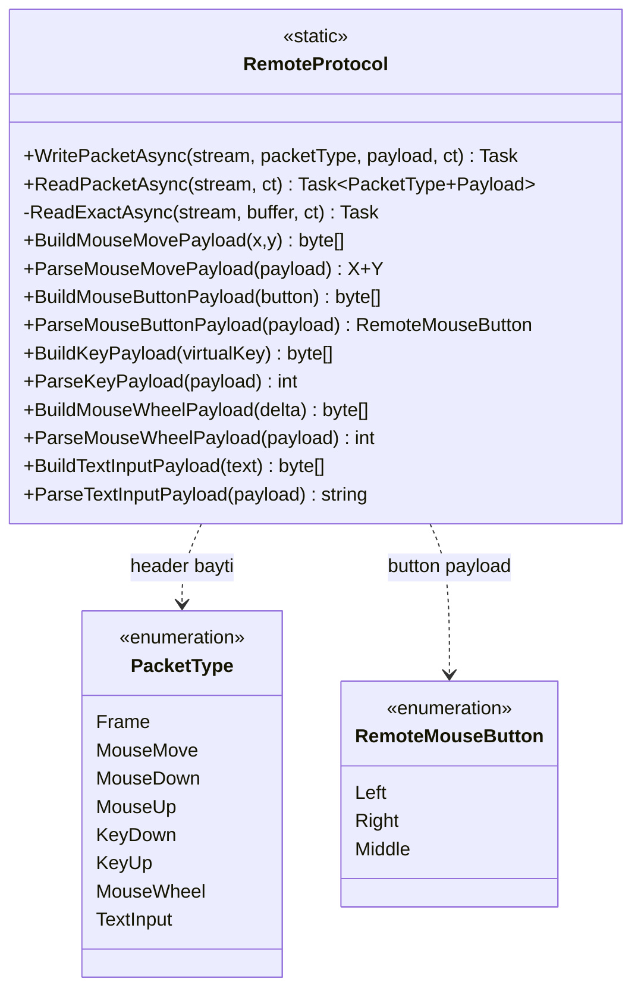

# Sunum notlari — RemoteDesktop.Core / RemoteProtocol

Slayt icin: asagidaki Mermaid diyagramini [mermaid.live](https://mermaid.live) veya Mermaid destekleyen araca yapistirip PNG/SVG olarak export edebilirsin.

---

## UML (Mermaid)

**Not:** `Frame` icin ayri `Build`/`Parse` yok; payload dogrudan JPEG baytlaridir. Gonderen `PacketType.Frame` ile `WritePacketAsync` cagirir; alan `byte[]` ile goruntu cozer.

---

## Metodlar — ne ise yarar? (slayt listesi)

### Baglanti / akis

1. **`WritePacketAsync`** — TCP akisina paket yazar: 1 bayt paket tipi + 4 bayt (big-endian) payload uzunlugu + payload. Asenkron yazma (`await WriteAsync`).

2. **`ReadPacketAsync`** — Akistan bir tam paket okur: 5 bayt header cozulur; uzunluk gecerliyse (0–20 MB) o kadar payload okunur; `(PacketType, byte[])` doner.

3. **`ReadExactAsync`** (private) — `ReadAsync` parca parca gelse bile buffer dolana kadar okur; baglanti koparsa (`read == 0`) IOException.

### Fare

4. **`BuildMouseMovePayload`** — Uzak ekran koordinatlari icin 8 bayt: `x`, `y` (her biri big-endian int32).

5. **`ParseMouseMovePayload`** — 8 baytlik payload’dan `(x, y)` cikarir; uzunluk yanlissa istisna.

6. **`BuildMouseButtonPayload`** — Sol/sag/orta icin 1 bayt.

7. **`ParseMouseButtonPayload`** — 1 bayttan `RemoteMouseButton` okur.

### Klavye

8. **`BuildKeyPayload`** — Windows sanal tus kodunu 4 bayt big-endian int olarak paketler.

9. **`ParseKeyPayload`** — 4 bayttan sanal tus kodunu okur.

### Teker

10. **`BuildMouseWheelPayload`** — Teker delta’sini 4 bayt big-endian int olarak paketler.

11. **`ParseMouseWheelPayload`** — 4 bayttan delta okur.

### Metin

12. **`BuildTextInputPayload`** — Metni UTF-8 byte dizisine cevirir.

13. **`ParseTextInputPayload`** — UTF-8 payload’i string yapar.

### Enum’lar

- **`PacketType`** — Kablo uzerindeki mesaj turu kodlari (goruntu, fare, klavye, teker, metin).

- **`RemoteMouseButton`** — Fare tusu (sol / sag / orta).
