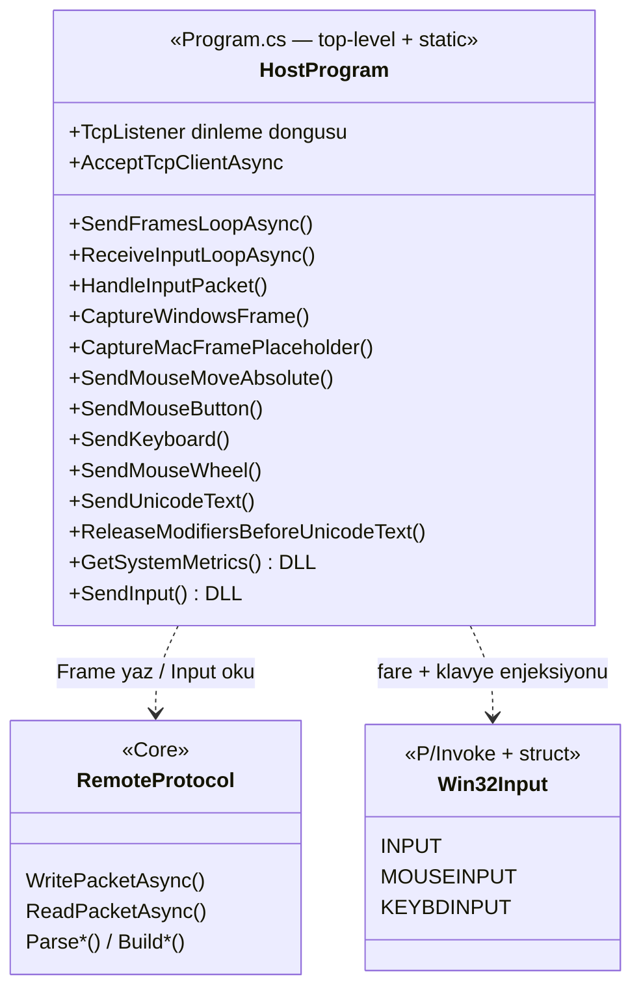
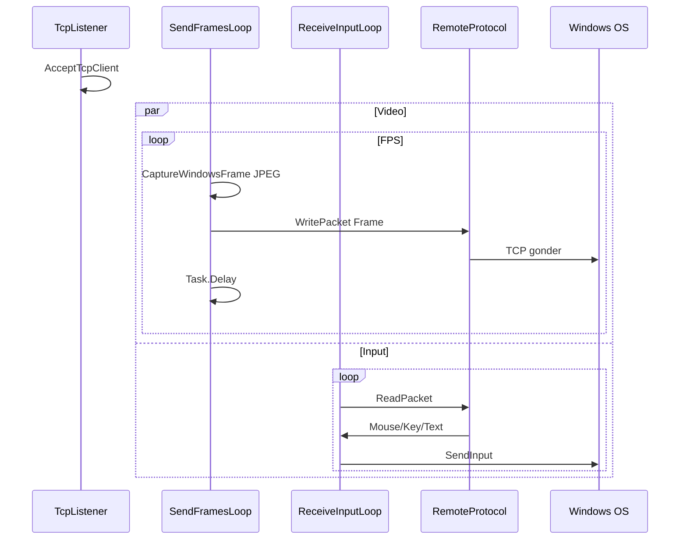

# Sunum notlari — RemoteDesktop.Host (`Program.cs`)

`Program.cs` **top-level statements** kullanir (sinif govdesi yok); asenkron donguler ve yardimci fonksiyonlar **file-scoped static** metotlardir. UML sunumda **mantiksal modul** olarak gosterilir.

Slayt icin Mermaid: [mermaid.live](https://mermaid.live)

---

## UML (Mermaid)

**Gorev akisi (sequence — istege bagli 2. slayt):**

---

## Bilesenler ve metotlar — ne ise yarar? (slayt listesi)

### Giris ve ag

1. **Komut satiri argumanlari** — `port`, `fps`, `jpegKalite` (kalite 25–90 arasi sinirlanir); `frameDelayMs` yaklasik `1000/fps` ile kare araligi.

2. **`TcpListener` + sonsuz `while`** — Belirtilen portta client bekler; baglanti kabul edilir, `NetworkStream` alinir, `NoDelay = true` (TCP Nagle azaltma).

3. **Paralel iki `Task`** — `SendFramesLoopAsync` ve `ReceiveInputLoopAsync` **ayni anda** calisir: biri surekli **Frame** yollar, digeri surekli **input paketi** okur. `Task.WhenAny` ile biri bitince veya hata olunca `CancellationTokenSource.Cancel` ile digeri durdurulur.

### Video gonderimi

4. **`SendFramesLoopAsync`** — Windows’ta `CaptureWindowsFrame`, degilse `CaptureMacFramePlaceholder`; JPEG’i `RemoteProtocol.WritePacketAsync(..., Frame, ...)` ile gonderir; `Task.Delay(frameDelayMs)` ile FPS’e uygun bekler.

5. **`CaptureWindowsFrame`** — Ekran boyutu `GetSystemMetrics`; `Graphics.CopyFromScreen` ile bitmap; JPEG codec ile kalite parametresiyle `MemoryStream`’e yazip byte[] doner.

6. **`CaptureMacFramePlaceholder`** — macOS’ta `screencapture` ile gecici JPG dosyasi, okunur, silinir (Windows host hedefi oldugundan sunumda kisaca).

### Input alimi ve OS

7. **`ReceiveInputLoopAsync`** — `ReadPacketAsync` ile paket okur, `HandleInputPacket` ile isler.

8. **`HandleInputPacket`** — Sadece **Windows**’ta gercek enjeksiyon; `switch` ile `MouseMove`, `MouseDown`/`MouseUp`, `KeyDown`/`KeyUp`, `MouseWheel`, `TextInput` ayristirilir; `RemoteProtocol.Parse*` ile payload cozulur.

9. **`SendMouseMoveAbsolute`** — Cozunurluk normalize; `MOUSEEVENTF_MOVE | MOUSEEVENTF_ABSOLUTE` ile `SendInput`.

10. **`SendMouseButton`** — Sol/sag/orta icin `MOUSEEVENTF_*DOWN` / `*UP` bayraklari ile `SendInput`.

11. **`SendKeyboard`** — `KEYBDINPUT`, `wVk`, `KEYEVENTF_KEYUP` bayragi ile `SendInput`.

12. **`SendMouseWheel`** — `MOUSEEVENTF_WHEEL`, `mouseData = delta`, `SendInput`.

13. **`SendUnicodeText`** — Karakter bazinda `KEYEVENTF_UNICODE` ile `SendInput` (Unicode metin).

14. **`ReleaseModifiersBeforeUnicodeText`** — Unicode oncesi Alt birakilir (`#` gibi Mac/Windows uyumu).

### Win32

15. **`GetSystemMetrics` / `SendInput`** — `user32.dll` P/Invoke; `INPUT` / `MOUSEINPUT` / `KEYBDINPUT` yapilari ile dusuk seviye giris simulasyonu.

---

## Ders baglantisi (Task / iptal)

- **Iki `async` dongu** ayni baglantida: **eszamanli** video ve input.
- **`CancellationToken`** — Oturum sonunda dongulerin guvenli cikisi.
- **`Task.WhenAny`** — Bir kanal kopunca veya tamamlaninca digerinin iptali.

---

## Dosya

- Tek C# dosyasi: `RemoteDesktop.Host/Program.cs`
- Bagimlilik: `RemoteDesktop.Core` (`RemoteProtocol`, `PacketType`, ...)
